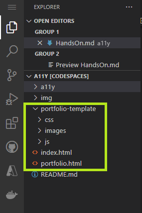
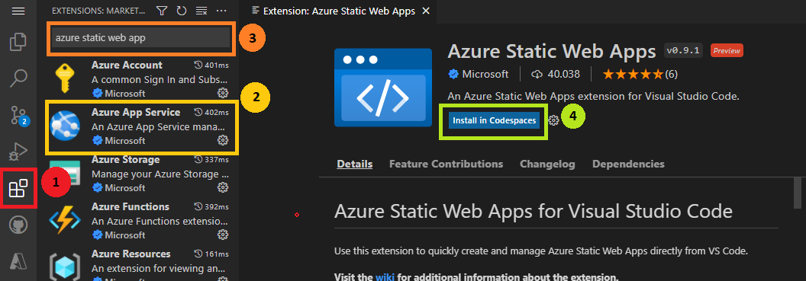

# Build your own accessible portfolio and deploy it to the cloud!

Now that you've learned about accessibility, including its basic concepts, inclusive design tips, semantic HTML, ARIA, and assistive technologies. The time has come to put all the knowledge you gained so far into practice ⌛✨.


---

## My portafolio
Aqui en este repositorio encontraras una plantilla de portafolio ya lista para que añadas tus proyectos y tus redes sociales, esta desarrollada con HTML, CSS y JavaScript.

# !!!!!!!!inserta imagen de como se ve la pagina

1.  The first thing you should do is to clone this repository to your device.
  ```
  git clone https://github.com/abrildur/A11y.git
```
2.  Luego de clonar el repositorio y abrir dicho repositorio en Visual Studio Code, veras los siguientes archivos  y carpetas (en la imagen inferior, los archivos señalados en el recuadro verde-limon) estos son los archivos editables desarrollados en HTML, CSS y JavaScript que puedes cambiar a tu gusto.

Puedes incluir cualquier imagen que desees puesto que sera tu portafolio.



3. Personaliza tu sitio web! eres libre de incluir cualquier imagen, estilo, tipo de texto o color que decidas, ya que este sera tu portafolio.

Ya lo personalice, **¿ahora cual es el reto que debo hacer?**

- Ahora tienes que asegurarte que en los archivos _index.html y portafolio.html_ se este **implementando de manera correcta el HTML Semantico y aplicar estados y propiedades ARIA en donde corresponde.**
- Verifica en tu sitio web que los tonos son los adecuados para personas
  - Si hay algun color que tu sientas que no corresponde y que 


### Ya termine de diseñar e implementar elementos accesibles a mi portafolio, ahora ¿como subire mi página web a la nube?

Muy sencillo mi estimado Padawan. Te llevaremos paso a paso para que puedas subir tu sitio web a la nube utilizando tu cuenta de Azure. 

> Si aun no tienes tu cuenta de Azure y eres estudiante, es tu momento de brillar y crearte una cuenta con tu correo universitario [siguiendo este link](https://azure.microsoft.com/es-mx/free/students/).

Primero, es necesario que descargues esta extension en tu Visual Studio code: [Azure Static Web Apps extension for Visual Studio Code](https://marketplace.visualstudio.com/items?itemName=ms-azuretools.vscode-azurestaticwebapps).

 ### ¿Como puedo descargar la extension de Azure Static Web App?
Con esta extension podremos subir tu codigo desde VSCode a la nube de Azure. Sigue los pasos que estan a continuacion para que puedas descargar esta importante extension.

 1. En tu Visual Studio Code, haz click en este icono que se ve en la imagen superior (recuadro rojo, cerca del circulo #1).
 2. Haz

¡Ahora ya estas listo para subir tu pagina web a la nube!

## ¿Como puedo subir mi página web a la nube de Azure?
 


 # ¡Felicidades, has cumplido con la mision! 
 ¡Lo lograste! Ahora ya sabes más sobre accesibilidad, tienes tu portafolio y sabes ahora como subir tu pagina web a la nube.


 

 Comparte este taller con tus amigos o cualquier otra persona que consideres necesite saber mas sobre accesibilidad.


