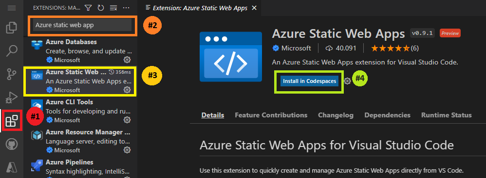

# Build your own accessible portfolio and deploy it to the cloud!

Now that you've learned about accessibility, including its basic concepts, inclusive design tips, semantic HTML, ARIA, and assistive technologies. The time has come to put all the knowledge you gained so far into practice ⌛✨.


---

## My portafolio
Within this repository you will find a portfolio template ready for you to add your projects and your social networks. It is created using HTML, CSS, and JavaScript.

# !!!!!!!!inserta imagen de como se ve la pagina

1.  The first thing you should do is to clone this repository to your device.
  ```
  git clone https://github.com/abrildur/A11y.git
```
2.  Luego de clonar el repositorio en tu dispositivo y abrir en Visual Studio Code la ubicacion del mismo , veras los siguientes archivos  y carpetas (en la imagen inferior, los archivos señalados en el recuadro verde-limon) estos son los archivos editables desarrollados en HTML, CSS y JavaScript que puedes cambiar a tu gusto.

------ In Visual Studio Code, after cloning the repository on your device, you will see the following files and folders (in the image below, the files marked in green-limon box). Here are the editable HTML, CSS, and JavaScript files that you can customize.


3. Personalize your website! This will be your portfolio, so you may use any image, style, type of text, or color you choose ❤️🎨✒️️. 

## I've already customized my portfolio, **so what's the next challenge?**.

- Tienes que asegurarte que en los archivos **_index.html y portafolio.html_** se este **implementando de manera correcta el [HTML Semantico](./HTMLSemantico.md), deberas aplicar [estados y propiedades ARIA](./Aria.md) en donde sea necesario.**
- Please make sure the **_index.html and portfolio.html** files are implementing the [Semantic HTML](./HTMLSemantic.md) correctly, and where necessary, apply the [ARIA states and properties](./ARIA.md).
- Sigue los consejos de [diseño de accesibilidad](./Pautas.md) que te habiamos compartido al inicio de esta aventura
  - Verifica si el contraste del fondo permite ver el contenido a cualquier persona (_recuerda que existen personas que son ciegas al color_).
    - Si necesitas hacer algun cambio en los colores, tamaños de letra o de tipo de fuente, los puedes hacer en el archivo
       _portfolio-template/css/index.css_
    - Puedes hacer uso de la siguiente herramienta [Accessible color palette builder](https://toolness.github.io/accessible-color-matrix/), es muy util para nosotros los programadores ya que nos permite saber que colores son accesibles para todas las personas.
  - Asegurate de incluir _alt_ en tus fotos y videos. 


## I have finished designing and implementing accessible elements to my portfolio, now how do I upload my website to the cloud?

This is very simple, my dear Padawan. We will walk you through the steps to upload your website to the cloud using your Azure account. 

> If you don't have an Azure account yet and you are a student, it's your time to shine and create an account with your university email [click here](https://azure.microsoft.com/es-mx/free/students/).

First, you need to download this extension in your Visual Studio code: [Azure Static Web Apps extension for Visual Studio Code](https://marketplace.visualstudio.com/items?itemName=ms-azuretools.vscode-azurestaticwebapps).

 ### How can I download the Azure Static Web App extension?
A Static Web App is a site built with JavaScript, HTML, CSS and other technologies and by using this it will allow you to quickly post your portfolio and any other website to the internet. 

With this extension we can upload your code from VSCode to the Azure cloud. Follow the steps below to download this important extension.


<br/>


 1. In your Visual Studio Code, click on this icon shown in the image above (red box, near circle #1).
 2. In the browser (orange rectangle) type and search for "Azure Static Web App".
 3. Click on the icon that looks like the one in the image (yellow rectangle).
 4. In a window similar to the one shown in the image, click on install (green rectangle) to complete the installation.

Now you are ready to upload your website to the cloud!

---

## Deploying my website to the cloud 🚀
 

1. Inside Visual Studio Code, select the Azure Logo in the Activity Bar to open the Azure extensions window.


---

 # Congratulations, you have accomplished the mission! 
 Congratulations! You've done it! By now, you know a bit more about accessibility, you have your portfolio, and you know how to upload your website to the cloud.


 

 Share this workshop with your friends or anyone else you think needs to know more about accessibility.


