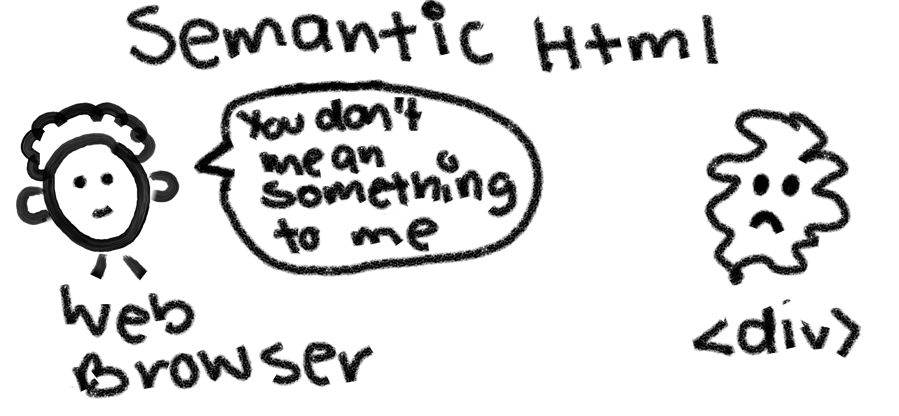
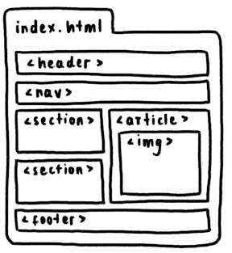

# Semantic HTML

This concept is basically very important for us developers, precisely because very soon you will be using in your professional life, certain frequent HTML tags. It is one of the most powerful tools when we want to implement accessibility in our website.

```HTML
<div>
    <p>Hi, I'm a div </p>
</div>
```

We can do infinite amounts of things with **divs**, however, _we won't always be able to use them_.

The semantic HTML will tell us to use appropriate properties for the texts, the paragraphs, the images, the sections, etc. This means that you do not have to use the _div_, but rather use the corresponding HTML tags for each element.



It will help us:  
- To make your website more accessible.
    - A browser like Bing and Google inspects our web page, checks our content in detail, and if we have many div's, it will say _"you mean nothing to me, div_". **This is why you need semantic HTML so that browsers can understand your content.**
- Improve your SEO position
- Improves the clarity of the code.



While all of these tags can be created with _div_, it is ideal to use the corresponding HTML tags. 

---

# Next lesson: [ARIA](./Aria.md).

In case you would like to go back to the previous lesson, [click here](./AssistiveTech.md).


